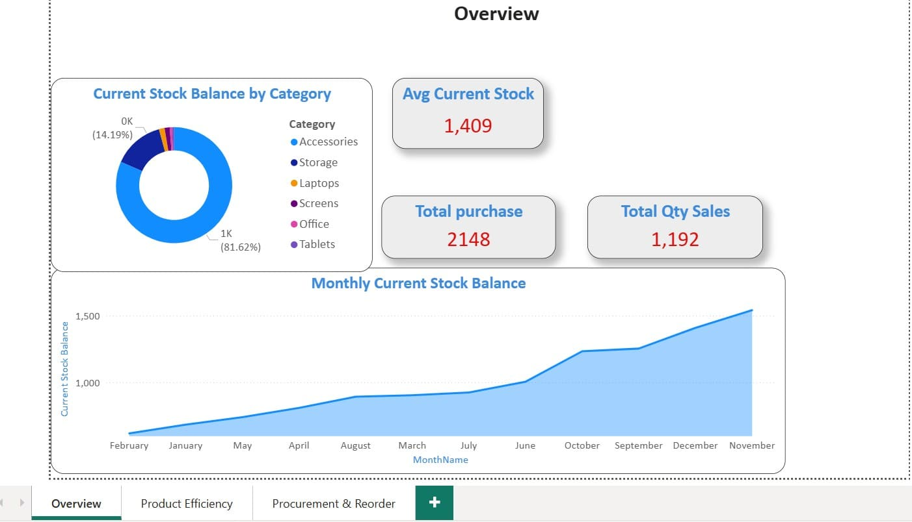

## 📦Power-Bi-Inventory-Management-Analysis
transform raw warehouse data (Sales, Purchases, and Opening Balances) into an interactive, actionable dashboard. The system automates critical supply chain decisions.

## 📌 Overview
This project is a comprehensive data analytics solution built in Power BI to transform raw warehouse data (Sales, Purchases, and Opening Balances) into an interactive, actionable dashboard. The system automates critical supply chain decisions, specifically focusing on "Reorder Point" forecasting and "Inventory Turnover" efficiency.

##  Insights
1.Best-selling products: We note that the accessories category achieves the highest turnover rate, which requires giving it priority in allocating liquidity.

2.Stagnant Products: Some products have been identified with a turnover rate of less than 0.5, representing retained cash (dead stock). We recommend promotional offers to liquidate them.

2.Risk Management: Some products have been identified as being completely out of stock, and purchase orders for them must be placed immediately to avoid customer dissatisfaction.

## 🛠 Tools & Skills
- Power BI Desktop  
- Power Query  
- DAX  
- Data Modeling  

---

## 📂 Dataset
All data tables are included in the `Dataset` folder as CSV file.

---

## 📷 Dashboard Preview
Here are screenshots of the dashboard:

---

## 📦 Full Project
A complete project file is available as a pbix: `Cash Flow Risk Analysis.pbix`

